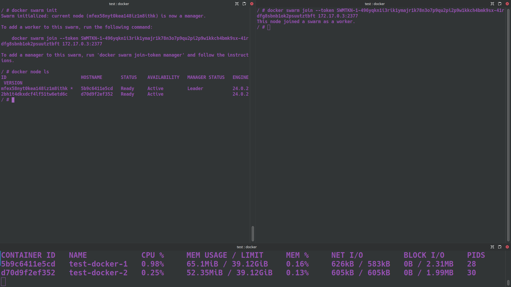
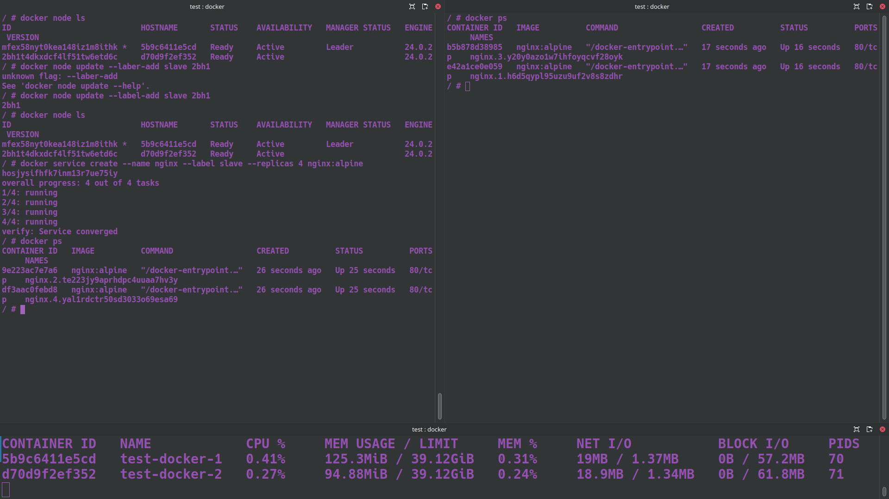

# Задание 1:
1) создать docker compose файл, состоящий из 2 различных контейнеров: 1 - веб, 2 - БД
2) запустить docker compose файл
3) по итогу на БД контейнере должно быть 2 реплики, на админере должна быть 1 реплика. Всего должно получиться 3 контейнера
4) выводы зафиксировать.

 ## Решение:
 - Создаём docker compose файл, состоящий из 2 различных контейнеров: 1 - веб, 2 - БД
 ```
 mkdir mariadb
 ```
 ```
 version: '3.8'

services:

  db:
    image: mariadb:10.10.2
    environment:
      MYSQL_ROOT_PASSWORD: GB
    volumes:
      - /home/vadim/GeekBrains/Containerization/HW-5/mariadb:/var/lib/mariadb
    deploy:
      mode: replicated
      replicas: 2

  adminer:
    image: adminer:4.8.1
    restart: always
    ports:
      - 6080:8080
    volumes:
      - /home/salerat/dumps:/dumps
    deploy:
      mode: replicated
      replicas: 1
```
- Запускаем docker compose файл
```
docker compose up -d
```
- По итогу на БД контейнере должно быть 2 реплики, на админере должна быть 1 реплика. Всего должно получиться 3 контейнера
```
docker ps
```


# Задание 2*
1) создать кластер и мастер и слейв ноды
2) задеплоить на ноду несколько экземляров какого0нибудь контейнера, например nginx.

## Решение:

- Создаём кластер мастер и слейв ноды.

Master:
```
docker swarm init
docker node ls
```
Slave:
```
docker swarm join --token SWMTKN-1-2p63cvnjbv6btkk5mgzcofx5v5tthcvixq0ylhlrwsgaelnwv3-3nz
tme6bfg811qdgy4rdkwynv 172.17.0.3:2377
```
- Деплоим на ноду несколько экземляров контейнера nginx.

Master:
```
docker service create --name nginx --label slave --replicas 4 nginx:alpine
docker ps
```
Slave:
```
docker ps
```


    
